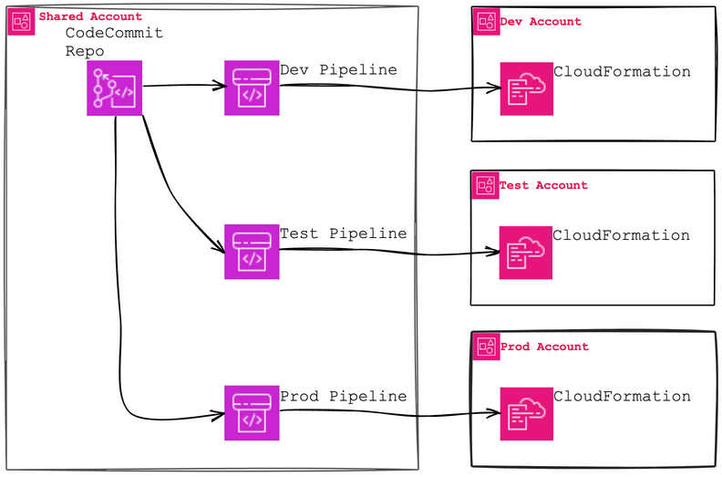
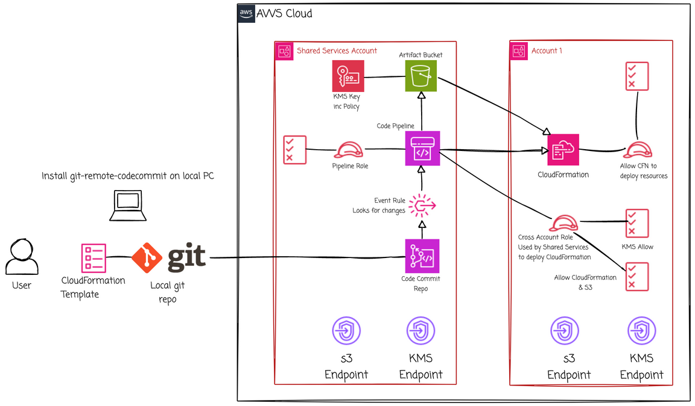

# Introduction
This directory shows how to use CodeCommit, CodePipeline, and cross account roles to deploy CloudFormation into remote accounts.

A separate pipeline is needed for each remote account and corresponds to a branch in the repo.

The process requires some central resources in the repo account and then roles & policies in the remote accounts.

The pipelines will be configured to trigger off a branch in the repository. This allows you to create and test your IaC in _dev_, then issue a Pull Request and merge into subsequent branches, e.g. _test_, and _prod_. 

# Templates
Following are the templates and the order in which to deploy them.

1. CodeCommit.yaml - This creates a basic CodeCommit repo. The default branch is _main_. You may want to create a _dev_ branch, and any others you want.
1. Repo test files - Once the repo is built, I've got a couple of trivial files to populate it.
    * ec2-test.yaml - This creates a basic EC2 instance.
    * config-files/config-template-dev-ec2.json - This contains parameters to use for the dev environment.
    * config-files/config-template-prod-ec2.json - This contains parameters to use for the prod environment. The prod version shows how different values can be used for different environments.
1. Central-Resources.yaml - This creates a KMS key, a shared S3 bucket for pipeline artefacts, plus a role and policy for CodePipeline.
1. Remote-IAM.yaml - This needs to be deployed to every account that will be receiving CloudFormation templates. It's the policies and roles to allow CloudFormation to run and cross account access to the artefact bucket.
    * Use the exports from the Central-Resources stack to help with the parameters.
1. CodePipeline-template.yaml - Finally, a simple template to create a pipeline for the sample file. There should be a separate pipeline for each environment of an application.
    * Use the exports from the Remote-IAM stack to help populate.
    * The one template will be used for each environment. While this pipeline is trivial, it demonstrates that a single pipeline template can be used for various environments. This keeps architectural consistency across environments.
